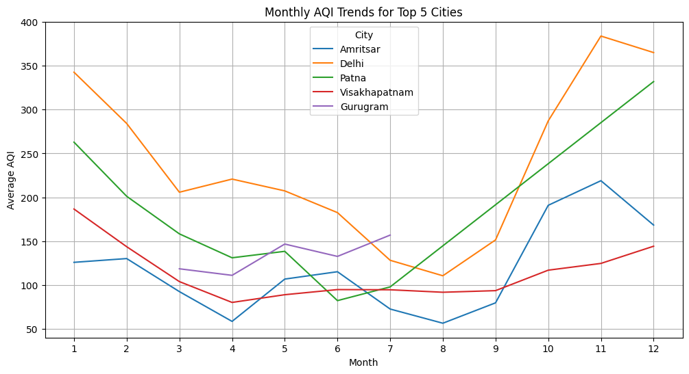
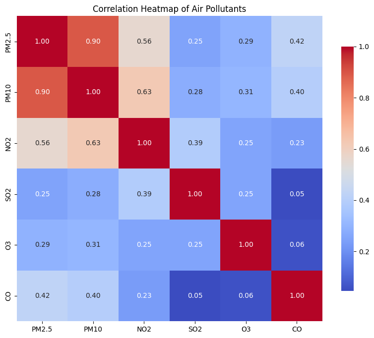
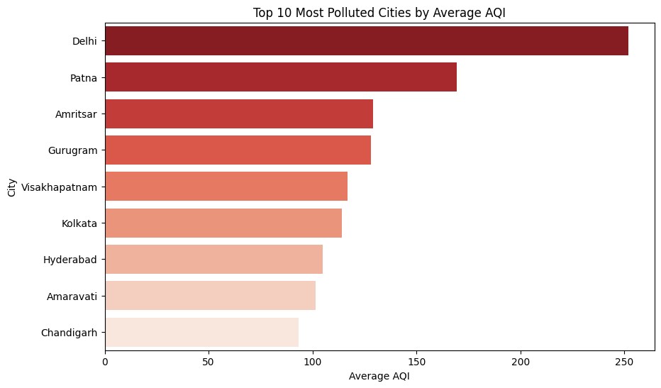
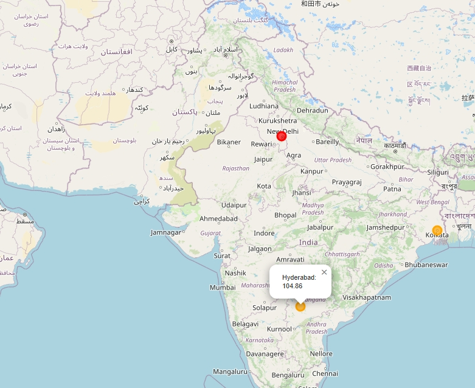

# 🌍 Air Quality EDA Project

## 📌 Project Overview
Air pollution is one of the most pressing global environmental challenges, directly impacting human health, ecosystems, and climate. Monitoring air quality helps policymakers and environmental agencies make informed decisions to control emissions and protect public health.

In this project, we explore **global air quality datasets** (with a focus on India) to identify pollution trends, seasonal variations, and city/country comparisons. The dataset used is sourced from Kaggle:

➡️ [Air Quality Data in India (Kaggle)](https://www.kaggle.com/datasets/rohanrao/air-quality-data-in-india)

---

## 🎯 Objectives
This project aims to:
1. Perform **Exploratory Data Analysis (EDA)** on air quality datasets.
2. Identify patterns and trends in **Air Quality Index (AQI)** and pollutants.
3. Compare **cities, regions, and seasons** in terms of air quality.
4. Visualize results with meaningful plots and maps.

---

## 📂 Dataset Description
The Kaggle dataset contains air quality measurements at **city-level** and **station-level**, recorded on an **hourly** and **daily** basis.

### Key Columns:
- `City`: Name of the city
- `Date`: Date of observation
- `AQI`: Air Quality Index
- Pollutants: `PM2.5`, `PM10`, `NO2`, `SO2`, `O3`, `CO`

---

## 📊 Visualizations

- 📉 **Line plot** showing monthly AQI trends for selected cities



- 🔥 **Heatmap** showing correlation between pollutants (`PM2.5`, `PM10`, `NO2`, `SO2`, `O3`, `CO`)



- 🏭 **Stacked bar chart** of pollutant contributions across cities



### 🗺 Map Visualization

One of the highlights of this project is the **interactive AQI map** built using Folium. It allows you to explore pollution levels geographically across different Indian cities.



You can download the file "aqi_map.html" and open it in any browser to view the full interactivity.

---

## ⚙️ Tools & Libraries Used
- **Python** 🐍
- **Pandas** – Data manipulation
- **NumPy** – Numerical operations
- **Matplotlib & Seaborn** – Data visualization
- **Folium** – Interactive map visualizations
- **Jupyter Notebook** – Development environment

---

## 📌 Results & Insights
- Identified the **most polluted cities** and the **cleanest city** on average.
- Found **seasonal variations** in AQI (higher pollution in winter months).
- Observed **strong correlation** between particulate matter (PM2.5 & PM10) and AQI.
- Noted **missing data patterns** in some pollutants.
- Compared **weekend vs weekday pollution trends**.
- Built an **interactive AQI map** for geographic exploration.

---

## 🚀 How to Run

1. **Clone the Repository**  

   ```bash
   git clone https://github.com/emadadnan000/Air-Quality-Insights-EDA.git
   cd Air-Quality-Insights-EDA
   ```

2. **Install Dependencies**  

   Ensure you have Python installed. Then, install the required libraries:  

   ```bash
   pip install -r requirements.txt
   ```

3. **Run the Jupyter Notebook**  

   Start Jupyter Notebook and open `AIR Quality EDA.ipynb`:  

   ```bash
   jupyter notebook
   ```

4. **View the Interactive Map**  

   After running the notebook, open `aqi_map.html` in your browser to explore the interactive map.

--- 
## 👤 Author
- **Emad Adnan (SMIT Project)**
- 🌐 GitHub: [EmadAdnan](https://github.com/emadadnan000)
